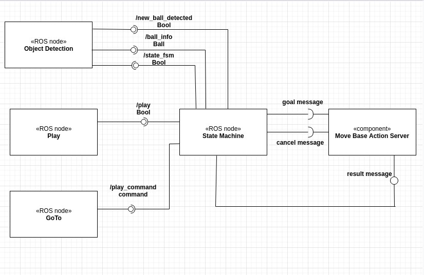

# exp_assignment3

### Introduction

### Software architecture

<p align="center">
  
  
</p>

### Packages and file list


### Installation and running procedure
To run the simulation it's necessary to put the package in a ROS workspace and then in the terminal run:
```
$ catkin_make
```
Then to launch the simulation:
```
$ roslaunch exp_assignment2 gazebo_world.launch
```
In another terminal to run the state machine :
```
$ rosrun exp_assignment2 state_machine.py
```
Whenever the user want to make the robot interact with the ball in another terminal has to run :
```
$ rostopic pub /reaching_goal/goal....
```
in order to send the message to the action server of the ball and position it in the desired position. To make the ball disappear the user has simply to set the z-coordinate of the position to a negative value.


### System's limitations

### Possible technical improvements

### Author and contact
Terrile Chiara
mail: **chiaraterrile97@gmail.com**
